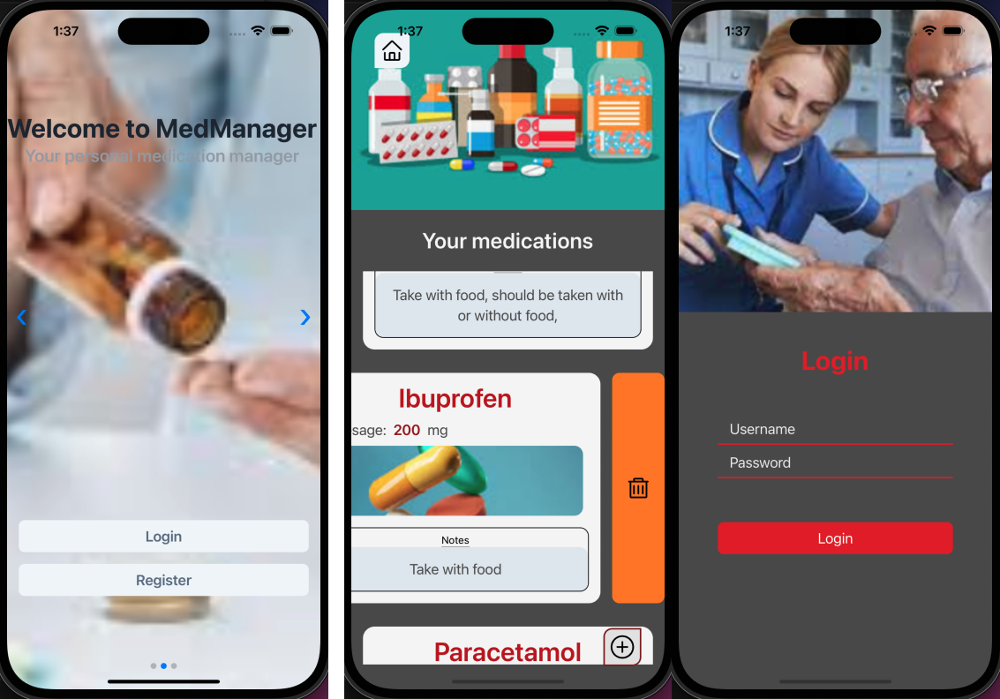

> MED Manager
> 

> Features

- App

```
React Native
Redux
Typescript
Swiper

```

- Server

* No time to do server side

```
NodeJs
Typescript
Express
Graphql
Prisma
```

> Require

```
Expo
XCode
Docker
```

> How to run

- Server (Not implement)

```
S1: make compose-up
S2: make install
S3: make run
```

- App

```
npm i
npm run ios
```
